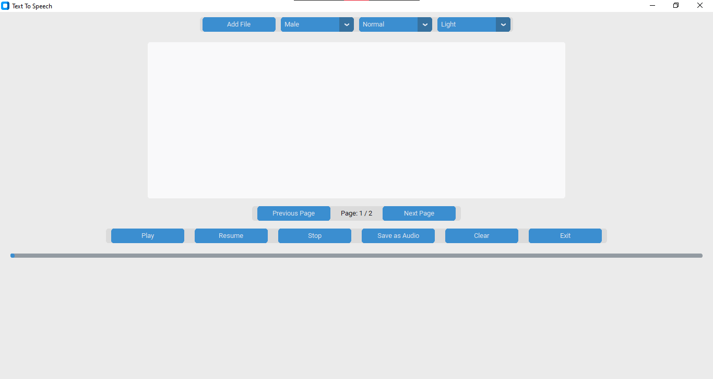
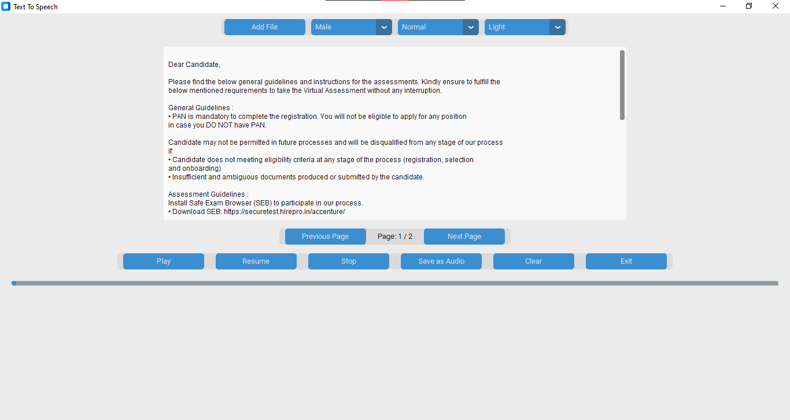

## 📢 Text To Speech Desktop Application

### A Text to Speech (TTS) desktop application built with Python, featuring:

- ✅ Text reading from PDF, DOCX, TXT files  
- ✅ Play, Pause, Resume, Stop controls  
- ✅ Voice selection (Male/Female)  
- ✅ Adjustable playback speed  
- ✅ Theme switching (Light, Dark, System)  
- ✅ Page navigation for PDFs  
- ✅ Save text as MP3 audio file  
- ✅ Built with CustomTkinter for modern UI and Pygame for smooth audio playback  

---

### 🖥️ Features

- File Support: PDF, DOCX, TXT  
- Voice Options: Male / Female voices  
- Playback Speed: 0.5x, 0.75x, Normal, 1.5x, 2.0x  
- Theme: Light, Dark, or System default  
- PDF Page Control: Next and Previous pages with page number display  

### 🎵 Audio Control
- Play
- Pause / Resume
- Stop
- Save as MP3

### 📝 Text Control
- Clear text area

### ❌ Exit
- Clean exit with audio stopped

### 📌 Screenshots

### Screenshot-1

### Screenshot-2

---

## 📦 Requirements

Install dependencies with:

### bash
- pip install pyttsx3 pygame PyPDF2 docx2txt customtkinter

### 🚀 How to Run
#### 1)Clone this repository:

- git clone https://github.com/Kumaresan277/Text-to-Speech-converter-.git
- cd your-repository-name
  
#### 2) Run the application:
- python your_script_name.py

---

### 🛠️ Tech Stack
- Python 3.x
- CustomTkinter: Modern themed GUI
- pyttsx3: Text-to-speech conversion
- Pygame: Audio playback with controls
- PyPDF2: PDF reading
- docx2txt: Word document parsing

---

### 👨‍🎓 Author
- Kumaresan D
- Team Project

